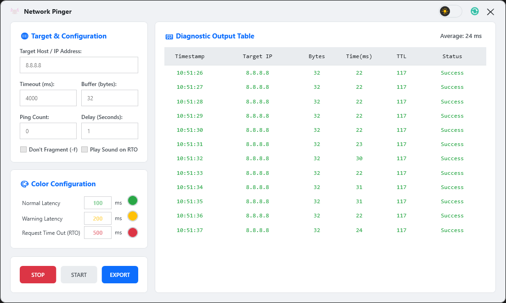
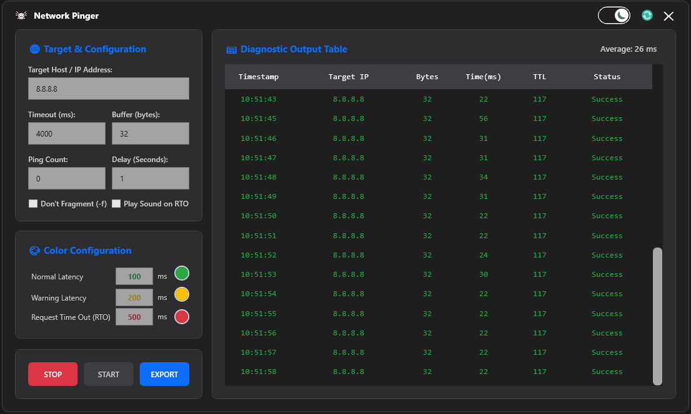

<div align="center">

# Network Pinger

A lightweight, modern WPF desktop application for continuously pinging a host or IP address, with real-time latency visualization, configurable thresholds, and CSV export.


</div>

## Overview

Network Pinger is a Windows desktop utility built with C# and WPF (.NET Framework 4.8) for monitoring network connectivity and latency in real time. It wraps the standard ICMP ping functionality in a clean, frameless, themeable UI, color-codes results based on configurable latency thresholds, and lets you export the ping log to CSV for later analysis.

## Features

- **Continuous or fixed-count pinging** — run an unlimited ping loop or stop automatically after a specified number of packets.
- **Configurable ping parameters** — target host/IP, interval, timeout, buffer size, and the "Don't Fragment" flag.
- **Color-coded latency thresholds** — define custom Normal, Warning, and Timeout/RTO thresholds (in ms), each with a user-selectable color.
- **Live results grid** — timestamp, resolved IP, packet size, round-trip latency, TTL, and status for every ping, with auto-scroll to the latest entry.
- **Running average latency** — calculated live across all successful pings in the current session.
- **Audible alerts** — optional sound notification on warning/timeout/failure events.
- **Light & dark themes** — toggle between light and dark UI themes, applied dynamically via WPF resource dictionaries.
- **Custom window chrome** — frameless, draggable title bar for a modern look.
- **CSV export** — save the full ping log to a timestamped `.csv` file for reporting or offline analysis.
- **Persistent settings** — all configuration (target, thresholds, colors, theme, sound) is automatically saved to and restored from `%LocalAppData%\Network Pinger\settings.json`.

## Screenshots

<p align="center">
  
  
</p>

## Getting Started

### Prerequisites

- Windows 7 SP1 or later (Windows 10/11 recommended)
- [.NET Framework 4.8](https://dotnet.microsoft.com/en-us/download/dotnet-framework/net48) (typically pre-installed on modern Windows)
- Visual Studio 2019/2022 with the **.NET desktop development** workload (only required to build from source)

### Build from source

1. Clone the repository:
   ```bash
   git clone https://github.com/xecvas/NetworkPinger.git
   cd NetworkPinger
   ```
2. Open `Network Pinger.sln` in Visual Studio.
3. Build the solution (`Ctrl+Shift+B`) or publish a `Release` build.
4. Run `Network Pinger.exe` from `bin/Release` (or `bin/Debug`).

### Download a release

Alternatively, download the latest pre-built executable from the [Releases](https://github.com/xecvas/NetworkPinger/releases) page and run `Network Pinger.exe` directly — no installation required.

## Usage

1. Launch **Network Pinger**.
2. Enter a target **hostname or IP address** (defaults to `8.8.8.8`).
3. Configure the ping **interval**, **count** (`0` for continuous), **timeout**, and **buffer size** as needed.
4. Set your preferred **latency thresholds** and **colors** for Normal, Warning, and Timeout states.
5. Optionally enable **sound alerts** and choose a **light/dark theme**.
6. Click **Start** to begin pinging. Results stream into the grid in real time with color-coded rows.
7. Click **Stop** at any time to halt the current session.
8. Click **Export** to save the current results as a CSV file.

All settings are remembered automatically between sessions.

## Project Structure

```
Network Pinger/
├── Models/
│   ├── AppSettings.cs        # Persisted user settings (load/save as JSON)
│   ├── PingConfig.cs         # Runtime configuration for a ping session
│   └── PingResultModel.cs    # Single ping result row for data binding
├── Services/
│   └── PingEngine.cs         # Core async ICMP ping loop and result evaluation
├── Utilities/
│   ├── ExportHelper.cs       # Async CSV export
│   └── ThemeHelper.cs        # Light/dark theme + brush helpers
├── assets/                   # Icons and images
├── App.xaml / App.xaml.cs    # Application entry point
└── MainWindow.xaml / .xaml.cs# Main UI and interaction logic
```

## Built With

- **C#** / **WPF** on **.NET Framework 4.8**
- `System.Net.NetworkInformation.Ping` — ICMP ping operations
- `System.Web.Script.Serialization.JavaScriptSerializer` — settings persistence
- `System.Windows.Forms.ColorDialog` — color picker for thresholds

## Contributing

Contributions are welcome! If you'd like to contribute:

1. Fork the repository.
2. Create a feature branch (`git checkout -b feature/my-feature`).
3. Commit your changes (`git commit -m "Add my feature"`).
4. Push to the branch (`git push origin feature/my-feature`).
5. Open a Pull Request.

Please keep changes consistent with the existing .NET Framework 4.8 / WPF target and avoid introducing dependencies on newer .NET runtimes.

## License

This project is licensed under the terms found in [LICENSE.txt](LICENSE.txt).

## Author

Created with ❤️ by <a href="https://github.com/xecvas">xecvas</a>